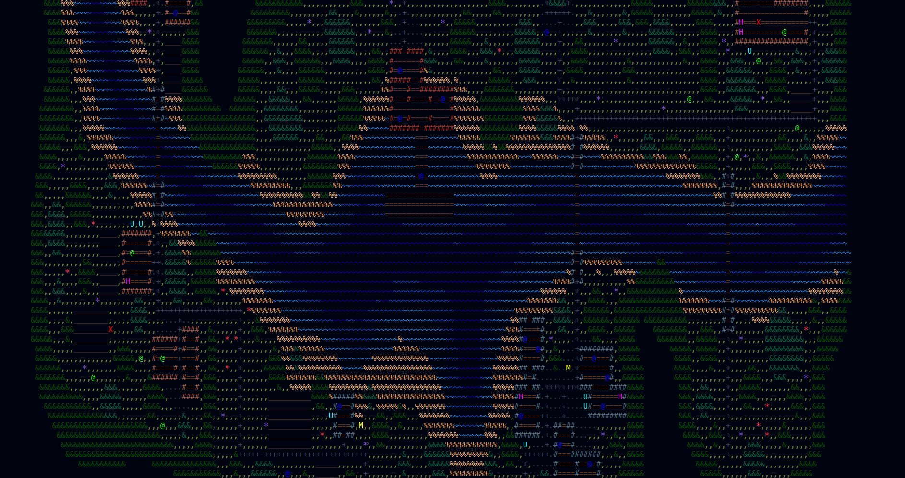

# The Invasion: An Open World RPG

## Elevator Pitch:
  Stylistically inspired by Dwarf Fortress and command line programs like Radare2,
an open-world RPG with gameplay heavily influenced by early Fallout games and the Elder Scrolls series.

## Development:
### Current State:
  **Not usable**
  The game is very early in development, with little functionality implemented.
  An existing older prototype is being used to develop this version.

### Structure:
  #### resources
  Contains JSON files defining the types of entities, items, and tiles in the game.
  Also contains the map_data directory containing the starting locations and states
  of all the tiles/entities for each map.
  #### saves
  Each saved game is an individual JSON file containing the state of the player and map,
  ensuring the player can save/load their progress.
  #### src
  Contains the logic for the game.
    ##### main.rs
    Logic for the main game loop; loads current map and save data, updates state of all entities,
    listens/responds to player input, writes to save files.

### External Dependencies:
- [Macroquad](https://macroquad.rs/)
    Used for rendering ASCII-symbols in a grid without printing to the terminal, to allow for zooming and camera panning.
- [Serde](https://serde.rs/)
    Used for reading and writing to the various JSON files used by the game.
